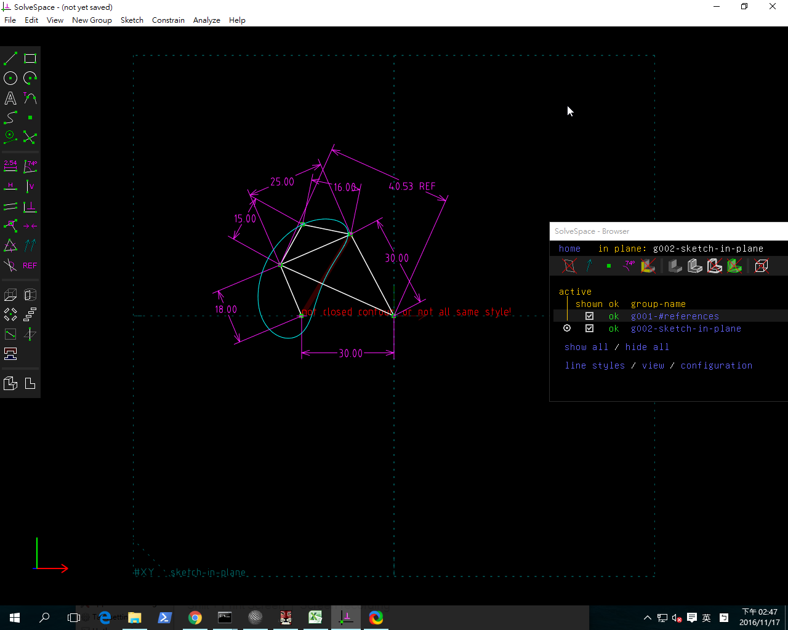

Title:40423245 2016/10/28 W07
Date: 2016-10-28 20:00
Category: Misc
Tags: 使用導引
Author: 40423245

有關 Solvespace 機構模擬功能介紹, 與 機構驗證模擬結果

 Solvespace 平面四連桿機構模擬

Python3 平面四連桿機構模擬:

利用三角函數推導四連桿機構的運動模擬, 即已知長度 18 公分的連桿以逆時針方向旋轉, 希望求三角形頂點的運動座標.

直接利用 Solvespace Analyze-Trace Point-Stop Trace 得到下列繞行路徑:

第七周影片 Solvespace的四連桿機構模擬分析
<iframe src="https://player.vimeo.com/video/195089514" width="640" height="428" frameborder="0" webkitallowfullscreen mozallowfullscreen allowfullscreen></iframe>

<a href="https://vimeo.com/195089514">2016 Fallcadpb w7</a> from <a href="https://vimeo.com/user47996237">40423245</a> on <a href="https://vimeo.com">Vimeo</a>.

