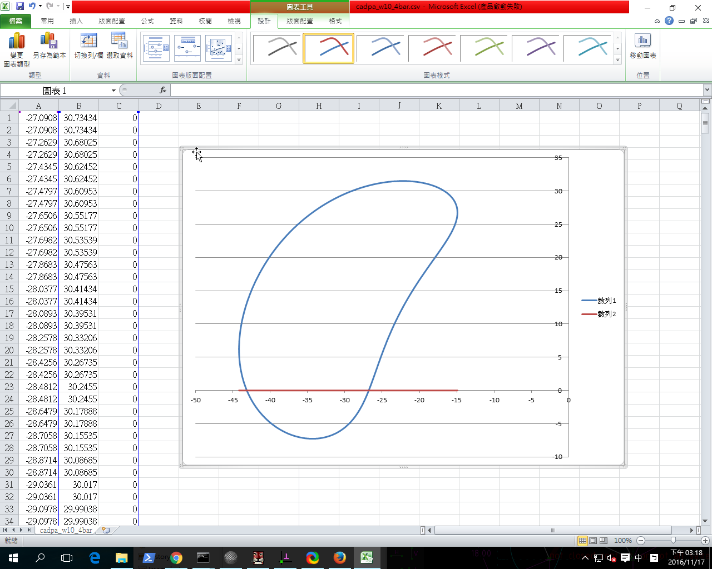

Title: 2016/11/18 W10
Date: 2016-11-18 13:00
Category: Misc
Tags: 使用導引, 創造力, 表達能力, 協同設計
Author: 40423245

有關 Solvespace 機構模擬功能介紹, 與 Python3 及 Brython 程式驗證

<!-- PELICAN_END_SUMMARY -->

## Solvespace 平面四連桿機構模擬

直接利用 Solvespace Analyze-Trace Point-Stop Trace 得到下列繞行路徑:

將所得到的點座標 .csv 以 Excel 畫圖, 得到:

Python3 平面四連桿機構模擬:

接下來利用三角函數推導四連桿機構的運動模擬, 即已知長度 18 公分的連桿以逆時針方向旋轉, 希望求三角形頂點的運動座標.

首先利用 Brython, 讀取 data 目錄中的 cadpa_w10_4bar.csv 座標檔案, 然後以 splitlines() 及 split() 取出各點的 x 座標與 y 座標後, 將點連成路徑曲線如下:

心得：這次的教學考驗了我們的表達能力，在繪出路徑之後要利用Excel以及Brython在網誌上表現出來，雖然曾經有在網誌上繪圖的經驗，但還是很陌生需要好好的練習。

第十週影片 Solvespace 平面四連桿機構模擬

<iframe src="https://player.vimeo.com/video/192769520" width="640" height="480" frameborder="0" webkitallowfullscreen mozallowfullscreen allowfullscreen></iframe>

<a href="https://vimeo.com/192769520">2016 Fallcadp W10</a> from <a href="https://vimeo.com/user47996237">40423245</a> on <a href="https://vimeo.com">Vimeo</a>.

<!-- 導入 Brython 標準程式庫 -->

<!-- 啟動 Brython -->

<!-- 以下實際利用  Brython 畫兩條直線 -->

<canvas id="fourbar" width="600" height="400"></canvas>

