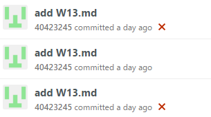

Title: 2016/12/09 W13
Date: 2016-12-09 20:00
Category: Misc
Tags: 使用導引, 創造力, 表達能力, 協同設計
Author: 40423245

第十三週上課進度

1.將SolveSpace的檔案存成html檔,並且把html檔案放進網誌裡面

利用SolveSpace的轉檔功能將檔案存成html檔,並且更改成http設定,以及路徑設定，利用嵌入網頁的指令,把html檔案放進網誌裡面

2.遠端網誌無法更新

在上課期間將上禮拜繪製的組合件在網誌上顯示出來，但當版本上傳後 github pages 無法正確更新, 試著使用 git rm -f -r plugin/liquid_tags/test_data 後提交推送。

在上課期間不能將倉儲推上遠端真的讓我嚇了一跳，還好在後來有順利解決問題。

第十三週影片
<iframe src="https://player.vimeo.com/video/195145829" width="640" height="480" frameborder="0" webkitallowfullscreen mozallowfullscreen allowfullscreen></iframe>

<a href="https://vimeo.com/195145829">2016 Fallcadp W13</a> from <a href="https://vimeo.com/user47996237">40423245</a> on <a href="https://vimeo.com">Vimeo</a>.

